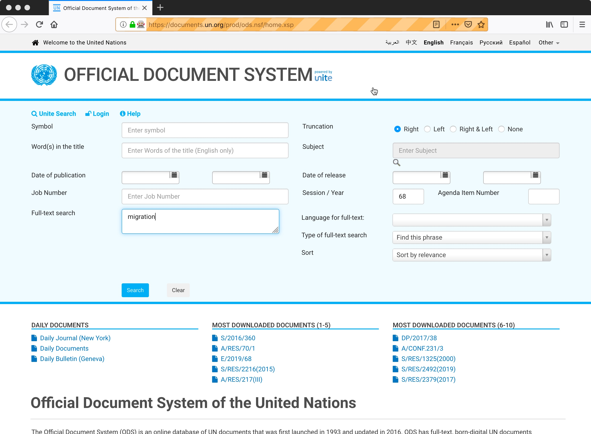
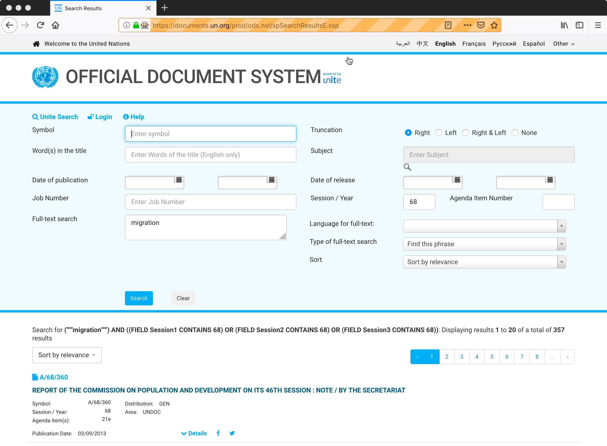

This is a minimal functioning example of the use of RSelenium. Selenium opens a browser and points, clicks, types, etc. to interact with a dynamic website as you might do manually.

We will use it to search the UN documents database for documents using the term "migration" (in UN Session 68) -- a classmate requested example -- navigate to the English pdfs on the first page of results, download three of them, and then go to the next page.

A comprehensive collection would need to iterate over sessions or dates systematically (in sufficiently small chunks to avoid capping out at the maximum results of 500), download all 20 documents on a given page (perhaps also or instead retrieving the Word document version; perhaps also or instead retrieving documents in other languages), click through to all pages of the search result, collecting all the documents on each.

(a) This will take a long time for a broad search term like we use here. The robots.txt file seems to allow crawling here, with a 10 second delay between requests.

(b) This is making database queries, so be gentle. The 10-second delay is more than reasonable. Aggressive crawling here may effectively turn into a denial-of-service attack, and could be reasonably interpreted as such.

(c) Selenium takes over your computer while it's operating. Long intensive scrapes like this can have memory leaks and similar effects that can crash your computer.

```{r}
library(RSelenium)
```

This is a bit esoteric, but you're basically opening a browser instance and sending it to the UN search page. In this case, we are using Firefox. You can also use Chrome, but I've had more luck with Firefox. The first command below sets up Firefox when it opens so that it downloads pdf files rather than opening them in the browser window.

```{r}
# Define a profile for Firefox that downloads pdf files instead of opening them in the browser with a plugin
pdfprof <- makeFirefoxProfile(list(
  "pdfjs.disabled"=TRUE,
  "plugin.scan.plid.all"=FALSE,
  "plugin.scan.Acrobat" = "99.0",
  "browser.helperApps.neverAsk.saveToDisk"='application/pdf'))

# Open a firefox browser
mydriver <- rsDriver(browser=c("firefox"),port=4444L, extraCapabilities=pdfprof)
remDr <- mydriver[['client']]
remDr$open()

# Open the UN search page
remDr$navigate("https://documents.un.org/")
```

You should see a firefox window open and look like this:

------

<center>
```{r,, out.width="70%",  out.extra='style="background-color: #9ecff7; padding:10px;  display:inline-block"', eval=TRUE, echo=FALSE}


```
</center>

------

Use SelectorGadget (https://selectorgadget.com/) to identify css selectors associated with the page elements you are interested in. (See the "Scraping with rvest" Tutorial for details where to get and how to use SelectorGadget.)

We're going to need to interact with three elements of the page. We first need to have Selenium find the text box for "Session" and type in "68". Then we need it to find the text box for full text search and type in "migration". Finally, we need to to find the search button and click it.

Note that the selector strings for some of these include escape characters. As we did with regular expressions, you will need to double these up for R to interpret them correctly.

```{r}
# Find the text box for Session
sessionbox_Element <-
  remDr$findElement(using="css",                     value="#view\\:_id1\\:_id2\\:txtSess")
# Type the session number into it
sessionbox_Element$sendKeysToElement(list("68"))

# Find the text box for full text search
fulltextbox_Element <-
  remDr$findElement(using="css",                      value="#view\\:_id1\\:_id2\\:txtFTSrch")
# Type the search term in
fulltextbox_Element$sendKeysToElement(list("migration"))
```

Now you're browser window should look like this:

------

<center>
```{r,, out.width="70%",  out.extra='style="background-color: #9ecff7; padding:10px;  display:inline-block"', eval=TRUE, echo=FALSE}


```
</center>

------

Now click search.

```{r}
# Find the search button
searchbutton_Element <-
  remDr$findElement(using="css", value="#view\\:_id1\\:_id2\\:btnRefine")
# Click it
searchbutton_Element$clickElement()
```

That gives us search results at the bottom:

------

<center>
```{r,, out.width="70%",  out.extra='style="background-color: #9ecff7; padding:10px;  display:inline-block"', eval=TRUE, echo=FALSE}


```
</center

There are 357 documents meeting our query, with 20 on each page.

To get to the English pdf (only) for any one result, we need to reveal the link to it under that result's "Details" button.

So we find all 20 of those, click them all, and then click on the English pdf download links that are revealed.

(For illustration purposes, I only download three here.)

------
```{r}
# Find the 20 "Details" arrows
Details_Elements <- remDr$findElements(using="css", value=".odsIcon:nth-child(1)")
# click all of them
for (i in 1:20) { Details_Elements[[i]]$clickElement() }
#sapply(Details_Elements, function(x) x %>% clickElement)

# Find the 20 English pdf links
PDF_Elements <- remDr$findElements(using="css", value=".col-xs-4:nth-child(3) .fa-file-pdf-o")

for (i in 1:3) { #Just get three
  PDF_Elements[[i]]$clickElement()
  Sys.sleep(10)
}
```

The three files should be in your default Downloads folder. (This can probably be changed with another command in the Firefox profile.)

We're done with those 20, so go to the next page.
```{r}
nextpage_Element <-
  remDr$findElement(using="css", value=".disabled+ li a")
nextpage_Element$clickElement()
```

Repeat the file download on each page and click to the next until you're done.

Close your browser/server.
```{r}
mydriver$server$stop()
```

To do this systematically, you would have to put all of that in an automated loop --- looping over sessions wanted for new searches, within that looping over pages of the search results, and within that looping over document links to download -- which I "leave as an exercise."

This is VERY time-consuming and asks a lot of the server. I would very closely consider whether I really needed all the documents this broad search returns before I proceeded.