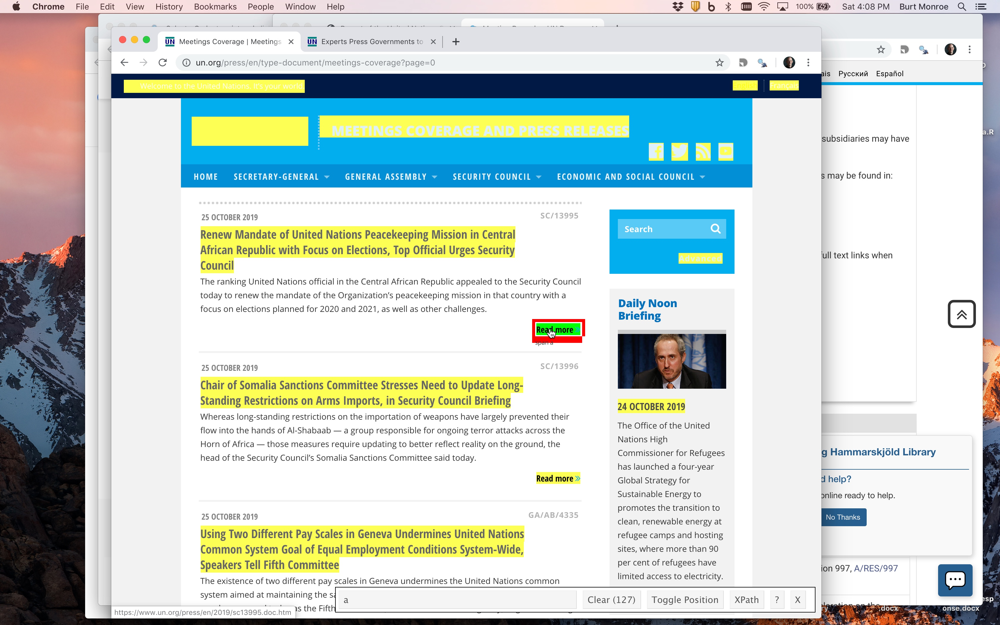
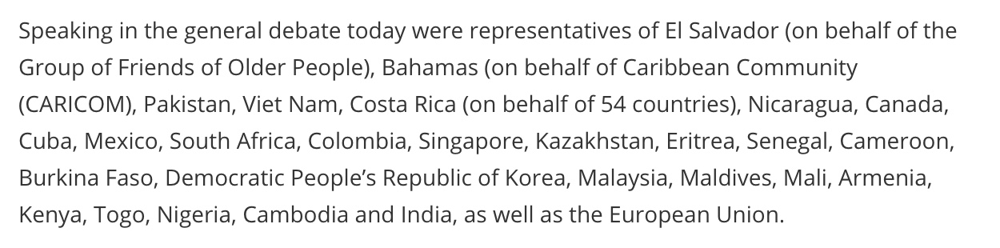
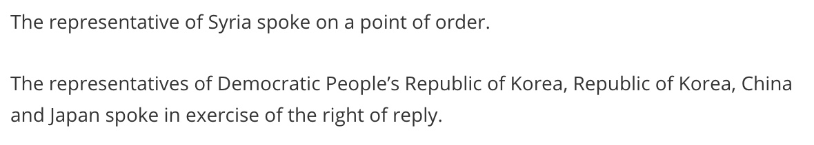
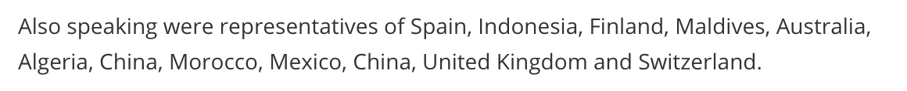
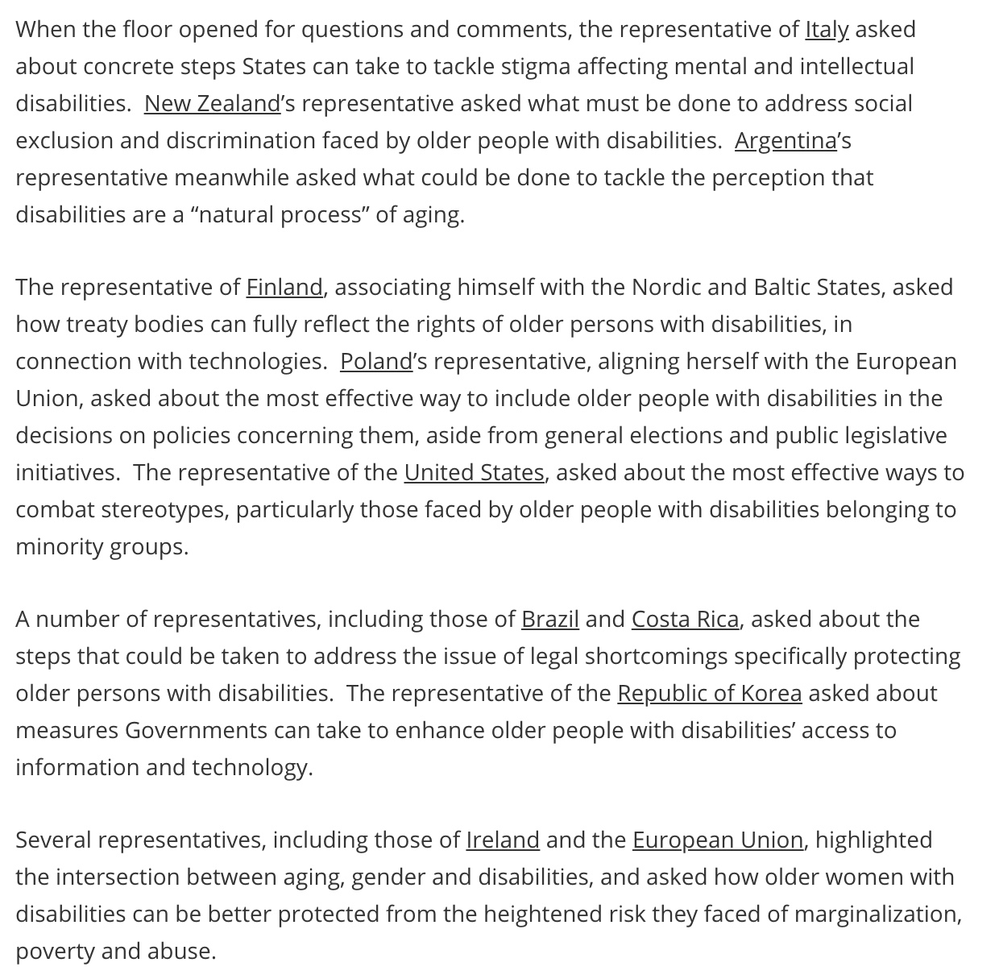
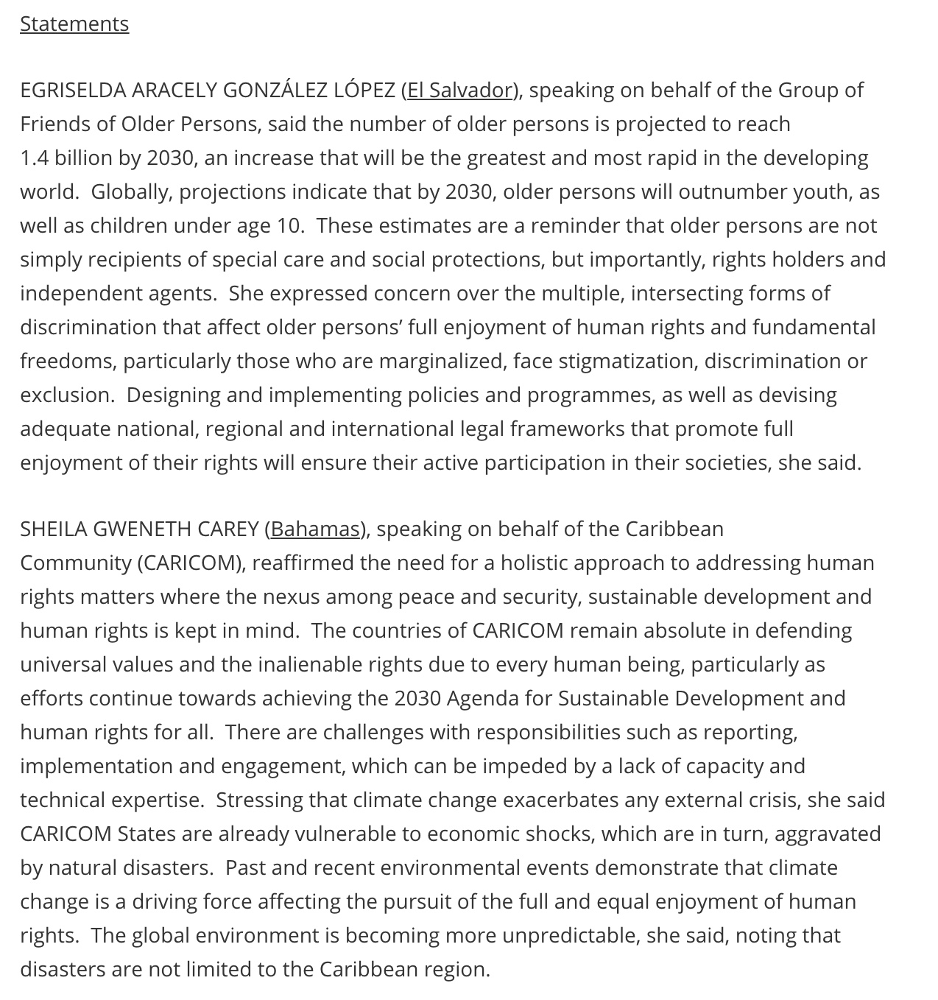
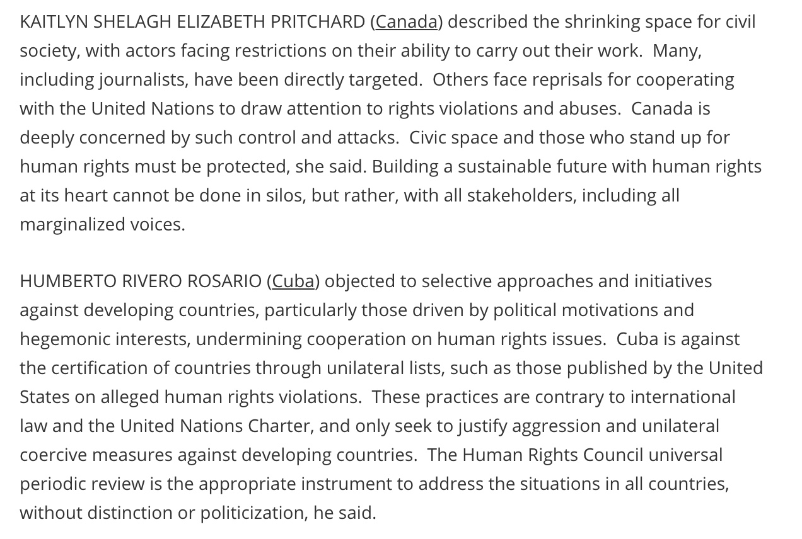
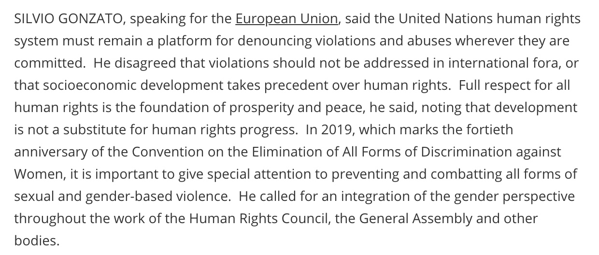
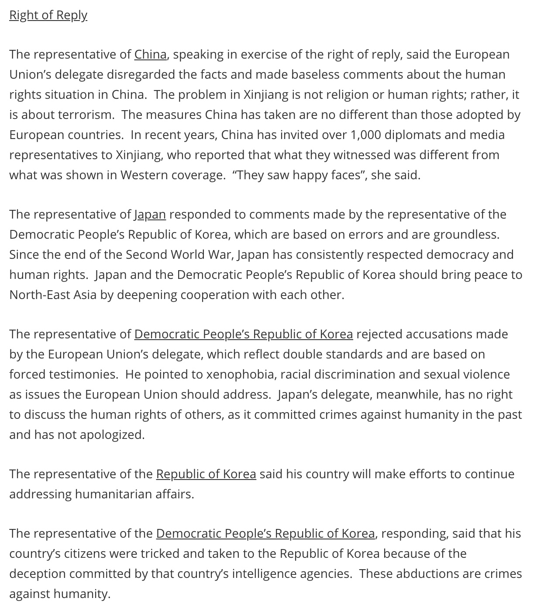

#Introduction

For this exercise we want to create a corpus of the UN meeting summaries provided for press purposes (a specific example requested by a member of the class) here:

https://www.un.org/press/en/type-document/meetings-coverage?page=0

This is an index page, with titles and snippets for 20 actual meeting summaries which are linked through "Read more" links. The next 20 are on page=1, and so on.

We will use here the package "rvest," which is similar in logic to the Python module "BeautifulSoup." We'll also use some other tidyverse packages to help us clean the data.

```{r}
library(rvest)
library(magrittr) # For the pipe operator
library(lubridate) # For cleaning up dates
library(stringr) # For cleaning up strings
library(knitr) # For displaying images in this notebook
```

## Scale of the problem and robots.txt

First, let's see how many of these pages there are. As of today, there are 341 pages like this, going back to May 2009. They have 20 pages linked each, except the last one with 6 links listed, for a total target of 340x20 + 6 = 7806 pages.

Let's see if we're allowed to do this:

https://www.un.org/robots.txt

We're looking at the directory "/press" and it doesn't appear to be disallowed. They do request a crawl delay of 10 seconds, so this it will take a minimum of (341 + 7806) x 10 seconds = 81470 seconds = 1358 minutes = 22.6 hours to download all of it.

# Downloading and parsing an index page

To download one of the top pages for analysis in rvest, use the `read_html` function. (The *textreadr* library also contains a `read_html` function, which extracts the blocks of text from an html page. To be sure you're using the form needed by rvest, specicify `xml2::readhtml`.)

```{r}
index_page <- xml2::read_html("https://www.un.org/press/en/type-document/meetings-coverage?page=0")
index_page
```

We've downloaded the page and rvest has stored it in an "xml_document." The page is coded in "xhtml" which is a structured variant of html using xml. XML is a text data format defined by nested tags. This nesting means you can think of XML, and XHTML, as a tree ... a graph with a root node, branching from that into other nodes, which themselves can branch. (In the language of XML, a node is an "element." If it contains any other elements, those are its "children"; if it is inside another element, that is its "parent"; if there are other elements within the same "parent" element, those are its "siblings.") rvest is based on traversing this tree structure, isolating the nodes you want and then extracting the information you want from them.

You can look at the html code that generates a page through your browser's "View Page Source" (or similar) command (which in most browsers is under a menu like "Developer"). It's certainly helpful to understand how html works, but in many cases, not strictly necessary. A few basics.  Note that the file begins with `<html` and ends with `/html>`, defining the root node of the tree (it has no parents). The tree has two branches to new nodes  contained inside the `html` tag (two children): `<head` (line 3) through `/head>` (line 30), and `<body` (line 31) through `/body>` (line 505). At the other extreme are the "leaves" of the tree ... tags that contain no further tags (elements that have no children), like `<h1 class="page-header default">Meetings Coverage</h1>`. Here, the `h1` is the element's "tag" (indicating in html a heading). The element has one "attribute" -- `class` -- with the "value" `"page-header-default"` which is an indicator about how to style (font, size, etc.) the content, defined elsewhere. The "contents" consists of everything in between the open and closing of the tag, and in this case that is also the "text" of the element: `Meetings Coverage`.

Most of what we want to extract, and some of what we don't want, is contained in the text of tags. In some cases, we want an attribute, as when we're looking for further links. But mostly, the attributes and tags themselves are what we'll use navigate the tree and to identify where the contents we want are.

## SelectorGadget and css selectors.

We're going to use a tool called "SelectorGadget" available here: https://selectorgadget.com/. When installed as an extension in the Chrome browser, it allows you to point and click at what you want to find and it defines a "css selector" that that identifies the element or elements you need.

So, once installed, we turn on SelectorGadget by clicking on the icon. Then we select one of the "Read more" links that we want to capture:

<center>
```{r,, out.width="70%",  out.extra='style="background-color: #9ecff7; padding:10px;  display:inline-block"', eval=TRUE, echo=FALSE}
include_graphics("images-UN_Meetings/SelectorGadgetReadMore.jpeg")
```
</center>

<center>
```{r,, out.width="70%",  out.extra='style="background-color: #9ecff7; padding:10px;  display:inline-block"', eval=TRUE, echo=FALSE}

```
</center>

That highlights everything you're currently capturing, so you now need to select things you want it *not* to capture. In this example, selecting one of the titles and then the sidebar "Latest Noon Briefings" (yours may look different) does the trick. Just the 20 "Read more" links are highlighted.

The pop-up bar on the bottom gives you the identified css selector as "#block-system-main .more-link a". We use that in the `html_nodes` command to get those 20 nodes.

```{r}
page_nodes <- html_nodes(index_page, "#block-system-main .more-link a")
page_nodes
```

What we want here are the links, which are there in `href="XX"`. "href" is an *attribute* of the html tag / node. We use the `html_attr` command to get those:

```{r}
html_links <- html_attr(page_nodes, "href")
html_links
```

```{r}
full_links <- paste("https://www.un.org",html_links,sep="")
full_links
```

So step 1 would be to cycle over the index pages from 0 to 341+ and save all the links.

## Parsing a meeting page

As new meetings are posted, any given meeting slides to the next page. So to keep consistency of the example, we'll work with a specific page.
```{r}
target_page <- read_html("https://www.un.org/press/en/2019/gashc4271.doc.htm")
```

### Extracting meeting-level data

Let's extract what we want piece by piece. The document identifier is indicated by css selector "document-symbol." Let's look at that node.
```{r}
node_docid <- html_node(target_page,".document-symbol")
node_docid
```

Now, we don't want the node, or an attribute of the node, we want the text, for which we use `html_text`.

```{r}
text_docid <- html_text(node_docid)
text_docid
```

We can streamline that code using the magrittr pipe operator we've seen before.

```{r}
text_docid <-
  html_node(target_page,".document-symbol") %>%
  html_text()
text_docid
```


We can get the date:

```{r}
text_date <- 
  html_node(target_page, ".date-display-single") %>%
  html_text()
text_date
```

We might want to use something like lubridate to get that in a more helpful form:

```{r}
date_ymd <- dmy(text_date) 
date_ymd
```

lubridate's "dmy" function converts from this "day spelled-out-month year" format. For lots of others, see the lubridate cheat sheet: https://rawgit.com/rstudio/cheatsheets/master/lubridate.pdf

We can extract the committee (although I think this information is captured in the "SHC" part of the docid).
```{r}
text_ctte <- 
  html_node(target_page, ".shs-term-selected a") %>%
  html_text()
text_ctte
```


Session:
```{r}
text_sess <- html_node(target_page, ".meeting-session") %>%
  html_text()
text_sess
```

There's some extraneous stuff there, so, assuming these all end with " Session," we'll just get rid of that. 
```{r}
text_sess <- str_split(text_sess," ")[[1]][1]
text_sess
```

Meeting info:
```{r}
text_mtg <- html_node(target_page, ".meeting-information") %>%
  html_text()
text_mtg
```

Title:

```{r}
text_title <- html_node(target_page, "h1") %>%
  html_text()
text_title
```

### Extracting utterance-level data

Now for the main text. Let's get each paragraph as a node:
```{r}
nodes_par <- html_nodes(target_page, "#block-system-main p")
nodes_par
```

From here, it gets subtle. Our target is the content of the summaries of statements made, or questions asked, by representatives of countries (and entities like the EU -- I'll just use the word "country"). Generally, we would need to look across several examples to find all the relevant patterns.

In this page, summaries of country statements take several forms. First, there is a list given of those who made formal ``statements.''

------

<center>
```{r, out.width="70%",  out.extra='style="background-color: #9ecff7; padding:10px;  display:inline-block"', eval=TRUE, echo=FALSE}

```
</center>

------

This is followed by a secondary list of speakers:

------

<center>
```{r,, out.width="70%",  out.extra='style="background-color: #9ecff7; padding:10px;  display:inline-block"', eval=TRUE, echo=FALSE}

```
</center>

------

(The point of order is never mentioned again, and we will ignore it.)


Then follows, under the heading, "Interactive Dialogues", a statement by "DANLAMI BASHARU, Chair of the Committee on the Rights of Persons with Disabilities" (not representing a country), which is followed by a series of statements made in "interactive dialogue:"

------

<center>
```{r,, out.width="70%",  out.extra='style="background-color: #9ecff7; padding:10px;  display:inline-block"', eval=TRUE, echo=FALSE}

```
</center>

------

Some participants get no summary:

------

<center>
```{r,, out.width="70%",  out.extra='style="background-color: #9ecff7; padding:10px;  display:inline-block"', eval=TRUE, echo=FALSE}

```
</center>

------

Then follows another report by a non-country speaker and another dialogue described as "questions and comments:" 

------

<center>
```{r,, out.width="70%",  out.extra='style="background-color: #9ecff7; padding:10px;  display:inline-block"', eval=TRUE, echo=FALSE}

```
</center>

------


Then follow the prepared statements. For example:

------

<center>
```{r,, out.width="70%",  out.extra='style="background-color: #9ecff7; padding:10px;  display:inline-block"', eval=TRUE, echo=FALSE}

```
</center>

------

Note that there are different verb constructions used to summarize statements, e.g.:

------

<center>
```{r,, out.width="70%",  out.extra='style="background-color: #9ecff7; padding:10px;  display:inline-block"', eval=TRUE, echo=FALSE}

```
</center>

------

"said," "said that," "reaffirmed," "objected to," and so on.


There is another interactive dialogue and more statements. Note that there are examples where the SPEAKER(<span style="text-decoration: underline">Country</span>) pattern is not used:

------

<center>
```{r,, out.width="70%",  out.extra='style="background-color: #9ecff7; padding:10px;  display:inline-block"', eval=TRUE, echo=FALSE}

```
</center>

------

Then, in the "Right of reply" section, we see country representatives call each other liars:

------

<center>
```{r,, out.width="70%",  out.extra='style="background-color: #9ecff7; padding:10px;  display:inline-block"', eval=TRUE, echo=FALSE}

```
</center>

------

One consistent thing is that the country whose statement is being summarized is always underlined. But so is some other stuff. Capturing all of the underlined words gives us:

```{r}
text_underlined <- 
  html_nodes(target_page, "u") %>%
  html_text()
text_underlined
```

There are other ways around this, but I'm going to show you an alternative to css selectors: XPATH. This defines a path on that xml tree we discussed.

We could duplicate the above with the following, which also finds all "u"-tagged nodes:

```{r}
text_underlined <- 
  html_nodes(target_page, xpath = "//u") %>%
  html_text()
text_underlined
```

We can find the *parent* node of a given *child*, e.g. the 61st, like this:

```{r}
html_node(html_nodes(target_page, "u")[61], xpath="parent::*")
```

There is a shortcut notation for this as well:
```{r}
html_node(html_nodes(target_page, "u")[61], xpath="..")
```

The stuff we want to skip is the set the headers. In those cases, the underlined text is the full paragraph text, so let's use that.

```{r}
u_nodes <- html_nodes(target_page,"u")
Nmax <- length(u_nodes)
keep_u_nodes <- vector("list",Nmax)
keep_p_nodes <- vector("list",Nmax)
for (i in 1:Nmax) {
  parent_node <- html_node(u_nodes[[i]],xpath="..")
  parent_node_text <- html_text(parent_node)
  u_node_text <- html_text(u_nodes[[i]])
  if (parent_node_text == u_node_text) {
    cat("Skipped underline",i,u_node_text,"\n")
  } else {
    keep_p_nodes[[i]] <- parent_node
    keep_u_nodes[[i]] <- u_nodes[[i]]
  }
}
keep_p_nodes <- keep_p_nodes[lengths(keep_p_nodes) != 0]
keep_u_nodes <- keep_u_nodes[lengths(keep_u_nodes) != 0]
```

We can be more subtle, but this has gotten long, so we'll define the text that goes with the country name crudely as everything *after* a country name is mentioned and *before* the paragraph ends, or a sentence with the next country name begins.

```{r}
N <- length(keep_u_nodes)
country <- vector("character",N)
for (i in 1:N) {
  country[i] <- html_text(keep_u_nodes[[i]])
}
utterance <- vector("character",N)
for (i in 1:(N-1)) {
  if (html_text(keep_p_nodes[[i]]) != html_text(keep_p_nodes[[i+1]])) {
    # just 1 country, or last country, in this paragraph
    utterance[i] <- str_match(html_text(keep_p_nodes[[i]]),paste("^.+",country[i],"(.+)$",sep=""))[1,2]
  } else {
    # more than 1 country in this paragraph
    utterance[i] <- str_match(html_text(keep_p_nodes[[i]]),paste(country[i],"(.+\\.)\\s.+",country[i+1],sep=""))[1,2]
  }
}
utterance[N] <- str_match(html_text(keep_p_nodes[[N]]),paste("^.+",country[N],"(.+)$",sep=""))[1,2]

```

That misses formulations of the form "A number of representatives, including those of Brazil and Costa Rica, asked about ..." For this page, we can hack that by replacing the missing values with a copy of the one that follows it. This isn't acceptable as a stable solution, since we haven't done nearly enough looking to be sure that's the only way the above breaks. (Also, this creates a corpus with duplicate documents, which can wreak havoc on techniques like LDA. An alternative would be to store it as one document, and store speaker data as a list of countries, most of which have only one country in the list.)

```{r}
missingutt <- which(is.na(utterance))
utterance[missingutt] <- utterance[missingutt+1]
```

That leaves a lot to be desired, but it's a good start. Let's put it in a data frame (for clarity,  and declare victory.

```{r}
meeting.df <- data.frame(mtgid=text_docid,docid=1:N,date=date_ymd,ctte=text_ctte, country=country,utterance=utterance)
head(meeting.df)
```

## R scripts

So, let's wind everything into R scripts. To keep things reasonable, we'll just collect 3 index pages, from page 201 to 203. This will collect 60 meetings (taking a 10 second pause between each as requested so this will take 10 minutes to run).

We'll collect the links from the index pages, then we'll collect and store the meeting pages, then we'll process the meeting pages, and store the data.

### Script to download

Change `eval=FALSE` to `eval=TRUE` to run this code -- takes 10+ minutes. (To collect more than these three index pages, change the `201:203` ... that will take longer.) Alternatively copy all to a file called something like `downloadmeetings.R` and execute with, for example, `Rscript downloadmeetings.R` in a shell terminal or `source(downloadmeetings.R)` in the R console.
```{r, eval=FALSE}
meeting_links <- rep("",60)
meeting_filenames <- rep("",60)
for (pagenum in 201:203) {
  index_page <-
    read_html(paste("https://www.un.org/press/en/type-document/meetings-coverage?page=",pagenum,sep=""))
  page_nodes <- 
    html_nodes(index_page, "#block-system-main .more-link a")
  html_links <- html_attr(page_nodes, "href")
  full_links <-
    paste("https://www.un.org",html_links,sep="")
  meeting_links[((pagenum-201)*20+1):((pagenum-201)*20+20)] <- full_links
  meeting_filenames[((pagenum-201)*20+1):((pagenum-201)*20+20)] <- str_sub(full_links,34,-1)
  # If you're going to be doing this over time
  # you might wish to store this and check against
  # it to be sure you're not duplicating
  Sys.sleep(10)
}

# Assumes a subdirectory called "meetings"
for (i in 1:60) {
  save_file <- paste("meetings/",meeting_filenames[i])
  target_page <- download.file(meeting_links[i],save_file)
}
```

### Script to parse meetings

We would then need a script that looped over the locally stored htm files, extracted the meeting-level and utterance-level data of interest in each, and wrote those data out. I'll "leave that as an exercise."


